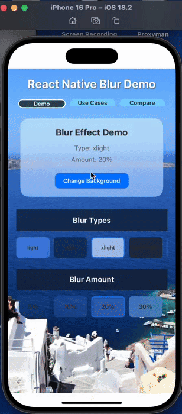
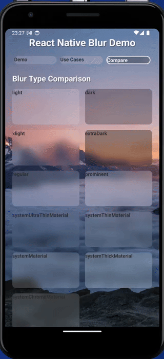

# @sbaiahmed1/react-native-blur

A modern React Native blur view component that provides native blur effects and **liquid glass effects** for both iOS and Android platforms.
<div align="center">
  <p>
    
    
    
    
  </p>

  <p>
    
    
    
  </p>
</div>
## Demo

<div align="center">
  
  
  <br>
  <em>iOS (left) and Android (right) blur effects in action</em>
</div>

## Features

- 🌊 **Liquid Glass Effects**: Revolutionary glass effects using iOS 26+ UIGlassEffect API
- 🎨 **Multiple Blur Types**: Support for various blur styles including system materials on iOS
- 📱 **Cross-Platform**: Works on both iOS and Android
- ♿ **Accessibility**: Automatic fallback for reduced transparency settings
- 🔧 **TypeScript**: Full TypeScript support with proper type definitions
- 🚀 **Turbo Module**: Built with React Native's new architecture (Fabric)
- 🎯 **Customizable**: Adjustable blur intensity, glass tint colors, and opacity
- 💡 **Performance Optimized**: Uses hardware acceleration for smooth rendering
- 🛠️ **Easy to Use**: Simple API for quick integration into your React Native projects
- 📦 **Modern**: Uses SwiftUI for iOS and Kotlin for Android, ensuring cutting-edge development practices
- 🔄 **Smart Fallbacks**: Graceful degradation from liquid glass to blur on older iOS versions

## 📊 Library Comparison

This section provides a detailed comparison between `@sbaiahmed1/react-native-blur` and other popular blur libraries in the React Native ecosystem.

### vs. [@react-native-community/blur](https://www.npmjs.com/package/@react-native-community/blur)

| Feature                      | @sbaiahmed1/react-native-blur       | @react-native-community/blur          |
|------------------------------|-------------------------------------|---------------------------------------|
| **New Architecture Support** | ✅ Full Fabric/Turbo Module support  | ❌ Limited support (crashes on android |
| **Android Real Blur**        | ✅ Hardware-accelerated real blur    | ✅ Hardware-accelerated real blur      |
| **iOS Blur Quality**         | ✅ Native UIVisualEffectView         | ✅ Native UIVisualEffectView           |
| **TypeScript Support**       | ✅ Full TypeScript definitions       | ⚠️ Basic TypeScript support           |
| **Maintenance Status**       | ✅ Actively maintained               | ⚠️ Community-maintained               |
| **Bundle Size**              | 🟡 Moderate (includes BlurView lib) | 🟡 Moderate (includes BlurView lib)   |
| **API Complexity**           | ✅ Simple, intuitive API             | ✅ Simple API                          |
| **Performance**              | ✅ Hardware-accelerated              | 🟡 iOS: Good, Android: Limited        |
| **Accessibility**            | ✅ Full reduced transparency support | ✅ Reduced transparency support        |
| **Documentation**            | ✅ Comprehensive with examples       | 🟡 Basic documentation                |

**Advantages of @sbaiahmed1/react-native-blur:**
- **True Android Blur**: Unlike the community version which only provides semi-transparent overlays on Android, our library delivers real hardware-accelerated blur effects on both platforms
- **Future-Ready**: Built from the ground up with React Native's new architecture (Fabric) in mind
- **Modern Codebase**: Uses the latest development practices with Kotlin for Android
- ** Uses Swift**: Use of Swift for iOS, ensuring modern and efficient native code
- **Better Performance**: Hardware acceleration on both platforms ensures smooth rendering
- **Active Development**: Regular updates and feature additions

**When to choose @react-native-community/blur:**
- If you need a battle-tested library with extensive community usage
- If bundle size is a critical concern
- If you're working with older React Native versions

### vs. [expo-blur](https://www.npmjs.com/package/expo-blur)

| Feature | @sbaiahmed1/react-native-blur | expo-blur |
|---------|------------------------------|----------|
| **Expo Dependency** | ✅ No Expo required | ❌ Requires Expo SDK |
| **Bare React Native** | ✅ Works with any RN project | ⚠️ Requires Expo configuration |
| **Android Support** | ✅ Real blur effects | ❌ Semi-transparent view only |
| **iOS Support** | ✅ Full native blur support | ✅ Full native blur support |
| **Bundle Size** | 🟡 Moderate | ✅ Lightweight (when using Expo) |
| **Setup Complexity** | ✅ Simple npm install | 🟡 Requires Expo setup |
| **Customization** | ✅ Extensive blur type options | 🟡 Limited blur types |
| **New Architecture** | ✅ Full Fabric support | ✅ Expo handles compatibility |
| **Development Experience** | ✅ Standard RN development | ✅ Excellent with Expo tools |
| **Production Flexibility** | ✅ Any deployment method | 🟡 Expo-specific deployment |

**Advantages of @sbaiahmed1/react-native-blur:**
- **No Vendor Lock-in**: Works with any React Native project without requiring Expo ecosystem
- **Real Android Blur**: Provides actual blur effects on Android, not just transparency
- **Flexibility**: Can be used in brownfield apps, custom native modules, and any deployment scenario
- **More Blur Types**: Extensive support for iOS system materials and custom blur types
- **Direct Control**: Full control over native implementation without abstraction layers

**When to choose expo-blur:**
- If you're already using Expo and want ecosystem consistency
- If you prefer Expo's managed workflow and tooling
- If you only need basic blur effects and iOS-focused functionality
- If you want the simplicity of Expo's managed dependencies

### Performance Comparison

| Metric | @sbaiahmed1/react-native-blur | @react-native-community/blur | expo-blur |
|--------|------------------------------|------------------------------|----------|
| **iOS Rendering** | Hardware-accelerated | Hardware-accelerated | Hardware-accelerated |
| **Android Rendering** | Hardware-accelerated real blur | Software overlay | Software overlay |
| **Memory Usage** | Optimized with BlurView | Low | Low |
| **CPU Impact** | Low (GPU-based) | iOS: Low, Android: Minimal | iOS: Low, Android: Minimal |
| **Frame Rate Impact** | Minimal on both platforms | iOS: Minimal, Android: None | iOS: Minimal, Android: None |

### Community & Support

| Aspect | @sbaiahmed1/react-native-blur | @react-native-community/blur | expo-blur |
|--------|------------------------------|------------------------------|----------|
| **GitHub Stars** | 🆕 Growing | 🌟 Established (3.8k+) | 🌟 Part of Expo ecosystem |
| **Issue Response** | ✅ Active maintainer | 🟡 Community-driven | ✅ Expo team support |
| **Documentation Quality** | ✅ Comprehensive | 🟡 Basic | ✅ Excellent (Expo docs) |
| **Update Frequency** | ✅ Regular updates | 🟡 Sporadic | ✅ Regular (with Expo releases) |
| **Breaking Changes** | ✅ Semantic versioning | ⚠️ Occasional | ✅ Managed by Expo |

### Migration Guide

#### From @react-native-community/blur

```tsx
// Before
import { BlurView } from '@react-native-community/blur';

// After
import { BlurView } from '@sbaiahmed1/react-native-blur';

// API is largely compatible, main differences:
// - Better Android blur quality
// - Additional iOS system material types
// - Improved TypeScript support
```

#### From expo-blur

```tsx
// Before
import { BlurView } from 'expo-blur';

// After
import { BlurView } from '@sbaiahmed1/react-native-blur';

// Key differences:
// - More blur type options available
// - Real Android blur instead of transparency
// - No Expo dependency required
```

### Recommendation

**Choose @sbaiahmed1/react-native-blur if:**
- You want real blur effects on Android
- You're building for the new React Native architecture
- You need maximum flexibility and don't want vendor lock-in
- You want the latest performance optimizations
- You're starting a new project or can afford migration time

**Choose @react-native-community/blur if:**
- You have an existing project that works well with it
- Bundle size is critical and Android blur quality is not important
- You need maximum stability and community testing

**Choose expo-blur if:**
- You're already committed to the Expo ecosystem
- You only need iOS blur effects
- You prefer managed dependencies and simplified setup

## Architecture Compatibility

This library is fully compatible with both React Native architectures:

- ✅ **New Architecture (Fabric)**: Full support with Turbo Modules
- ✅ **Old Architecture (Paper)**: Backward compatibility maintained

Both architectures have been tested and work perfectly without any additional configuration required.

## Installation

```bash
npm install @sbaiahmed1/react-native-blur
# or
yarn add @sbaiahmed1/react-native-blur
```

### iOS Setup

Run pod install:

```bash
cd ios && pod install
```

### Android Setup

### Requirements
- **Minimum SDK:** API level 24 (Android 7.0)
- **Target SDK:** API level 35 (Android 15)
- **Compile SDK:** API level 35 (Android 15)
- **Gradle:** 8.10.2
- **Kotlin:** 2.0.21

### Dependencies
The Android implementation uses the [BlurView library by Dimezis](https://github.com/Dimezis/BlurView):
```gradle
implementation 'com.github.Dimezis:BlurView:version-2.0.6'
```

### Implementation Details
The Android implementation leverages the BlurView library to provide real blur effects:

- **Real-time Blur:** Uses `RenderEffectBlur` for hardware-accelerated blur rendering
- **Hardware Acceleration:** Utilizes GPU rendering for optimal performance
- **Multiple Blur Algorithms:** Supports different blur implementations based on device capabilities
- **Performance Optimized:** Efficient blur rendering with minimal impact on app performance
- **Fallback Handling:** Gracefully handles devices with limited graphics capabilities
- **No Extra Permissions:** Does not require additional Android permissions

### Android Version Compatibility

This library automatically handles Android version compatibility to prevent `NoClassDefFoundError` issues:

- **Android 12+ (API 31+):** Uses `RenderEffectBlur` for optimal performance and modern blur effects
- **Android 10-11 (API 29-30):** Automatically falls back to `RenderScriptBlur` for compatibility
- **Older Android versions:** Graceful fallback to semi-transparent overlay when blur is not supported

**Note:** The library includes automatic API level detection and will choose the appropriate blur algorithm based on the device's Android version. This ensures compatibility across all supported Android versions without requiring any additional configuration.

#### Troubleshooting Android Issues

If you encounter `java.lang.NoClassDefFoundError: Failed resolution of: Landroid/graphics/RenderEffect;` on Android 10 or 11:

1. **This is automatically handled** - The library now includes fallback mechanisms
2. **Update to latest version** - Ensure you're using the latest version of this library
3. **Clean and rebuild** - Run `cd android && ./gradlew clean` then rebuild your project

The error occurs because `RenderEffect` was introduced in Android 12 (API 31), but the library now automatically detects the API level and uses compatible alternatives on older versions.

## Usage

### Basic Usage

```tsx
import React from 'react';
import { View, Text } from 'react-native';
import { BlurView } from '@sbaiahmed1/react-native-blur';

export default function App() {
  return (
    <View style={{ flex: 1 }}>
      <BlurView
        blurType="light"
        blurAmount={20}
        style={{
          position: 'absolute',
          top: 100,
          left: 50,
          right: 50,
          height: 200,
          borderRadius: 20,
        }}
      >
        <Text>Content with blur background</Text>
      </BlurView>
    </View>
  );
}
```

### Advanced Usage

```tsx
import React from 'react';
import { BlurView } from '@sbaiahmed1/react-native-blur';

function MyComponent() {
  return (
    <BlurView
      blurType="systemMaterial"
      blurAmount={50}
      reducedTransparencyFallbackColor="#FFFFFF80"
      style={{
        padding: 20,
        borderRadius: 15,
      }}
    >
      <Text>Advanced blur with custom fallback</Text>
    </BlurView>
  );
}
```

### Liquid Glass Usage (iOS 26+)

```tsx
import React from 'react';
import { BlurView } from '@sbaiahmed1/react-native-blur';

function LiquidGlassComponent() {
  return (
    <BlurView
      type="liquidGlass"
      glassType="regular"
      glassTintColor="#007AFF"
      glassOpacity={0.8}
      style={{
        padding: 20,
        borderRadius: 20,
      }}
    >
      <Text>Beautiful liquid glass effect</Text>
    </BlurView>
  );
}
```

## Props

| Prop | Type | Default | Description |
|------|------|---------|-------------|
| `type` | `'blur' \| 'liquidGlass'` | `'blur'` | The type of effect to apply (liquidGlass is iOS 26+ only) |
| `blurType` | `BlurType` | `'xlight'` | The type of blur effect to apply |
| `blurAmount` | `number` | `10` | The intensity of the blur effect (0-100) |
| `glassType` | `'clear' \| 'regular'` | `'clear'` | The type of glass effect (iOS 26+ only) |
| `glassTintColor` | `string` | `'clear'` | The tint color for glass effect (iOS 26+ only) |
| `glassOpacity` | `number` | `1.0` | The opacity of glass effect (0-1, iOS 26+ only) |
| `reducedTransparencyFallbackColor` | `string` | `'#FFFFFF'` | Fallback color when reduced transparency is enabled |
| `style` | `ViewStyle` | `undefined` | Style object for the blur view |
| `children` | `ReactNode` | `undefined` | Child components to render inside the blur view |

## Blur Types

The following blur types are supported:

### iOS & Android
- `'light'` - Light blur effect
- `'dark'` - Dark blur effect
- `'xlight'` - Extra light blur effect
- `'extraDark'` - Extra dark blur effect

### iOS Only (with fallbacks on Android)
- `'regular'` - Regular blur (iOS 10+)
- `'prominent'` - Prominent blur (iOS 10+)
- `'systemUltraThinMaterial'` - Ultra thin material (iOS 13+)
- `'systemThinMaterial'` - Thin material (iOS 13+)
- `'systemMaterial'` - Material (iOS 13+)
- `'systemThickMaterial'` - Thick material (iOS 13+)
- `'systemChromeMaterial'` - Chrome material (iOS 13+)

## Platform Differences

### iOS
On iOS, this component has been completely rewritten using **SwiftUI** for modern performance and features:

- **iOS 26+**: Uses native `UIGlassEffect` API for true liquid glass effects with customizable tint colors and opacity
- **iOS 13-25**: Uses enhanced `UIVisualEffectView` with precise blur intensity control
- **Older iOS**: Graceful fallback to standard blur effects
- **SwiftUI Integration**: Leverages SwiftUI's declarative UI for better performance and maintainability

### Android
On Android, the component uses the BlurView library to provide real blur effects with hardware acceleration. The implementation supports multiple blur algorithms and gracefully falls back to translucent overlay approximation on devices with limited graphics capabilities. Liquid glass effects fall back to enhanced blur with tint overlay.

## Accessibility

The component automatically respects the "Reduce Transparency" accessibility setting:

- **iOS**: When reduce transparency is enabled, the blur view is hidden and a fallback view with solid color is shown
- **Android**: The fallback color is always used as the base for the blur approximation

You can customize the fallback color using the `reducedTransparencyFallbackColor` prop.

## TypeScript Support

This package includes full TypeScript definitions:

```tsx
import { BlurView, BlurType, GlassType, BlurViewProps } from '@sbaiahmed1/react-native-blur';

// BlurType is exported for type checking
const blurType: BlurType = 'systemMaterial';

// GlassType for liquid glass effects
const glassType: GlassType = 'regular';

// BlurViewProps for component props
interface MyComponentProps {
  blurProps: BlurViewProps;
}

// Example with all liquid glass properties
const liquidGlassProps: BlurViewProps = {
  type: 'liquidGlass',
  glassType: 'regular',
  glassTintColor: '#007AFF',
  glassOpacity: 0.8,
};
```

## Example App

The package includes a comprehensive example app that demonstrates all blur types, liquid glass effects, and practical use cases. The example app features:

- **Main Demo**: Interactive blur type selector with live preview
- **Liquid Glass Examples**: Showcase of iOS 26+ glass effects with customizable properties
- **Practical Use Cases**: Real-world examples like cards, modals, and overlays
- **Comparison Views**: Side-by-side comparisons of different effects

To run the example:

```bash
cd example
yarn install
# For iOS
yarn ios
# For Android
yarn android
```

## Performance Considerations

- **iOS**: 
  - **SwiftUI Implementation**: Enhanced performance with declarative UI updates
  - **Liquid Glass (iOS 26+)**: Hardware-accelerated glass effects with minimal performance impact
  - **Blur Effects**: Native blur effects are hardware-accelerated and performant
  - **Smart Fallbacks**: Automatic degradation ensures smooth performance on older devices
- **Android**: Real blur effects are hardware-accelerated with fallback to lightweight overlay when needed
- Avoid using too many blur/glass views simultaneously on lower-end devices
- Consider using `reducedTransparencyFallbackColor` for better accessibility
- Liquid glass effects automatically fall back to enhanced blur on Android and older iOS versions

## What's New in v0.3.0

### 🌊 Liquid Glass Effects (iOS 26+)
- Revolutionary glass effects using Apple's new UIGlassEffect API
- Customizable glass types: `clear` and `regular`
- Adjustable tint colors and opacity for stunning visual effects
- Automatic fallback to enhanced blur on older iOS versions and Android

### 🔄 SwiftUI Rewrite
- Complete iOS implementation rewritten using SwiftUI
- Enhanced performance with declarative UI updates
- Better integration with React Native's new architecture
- Improved blur intensity control with precise animation handling

### 📱 Enhanced Example App
- New liquid glass demonstration section
- Interactive property controls for real-time customization
- Practical use case examples (cards, modals, overlays)
- Comparison views for different effect types

### 🛠️ Developer Experience
- Full TypeScript support for all new properties
- Improved component layout handling
- Better accessibility support with smart fallbacks
- Enhanced documentation and examples

## Contributing

See the [contributing guide](CONTRIBUTING.md) to learn how to contribute to the repository and the development workflow.

## License

MIT

## 📊 Stats

<div align="center">
  
  
  
  
</div>

---

## Credits

Built with [create-react-native-library](https://github.com/callstack/react-native-builder-bob)
